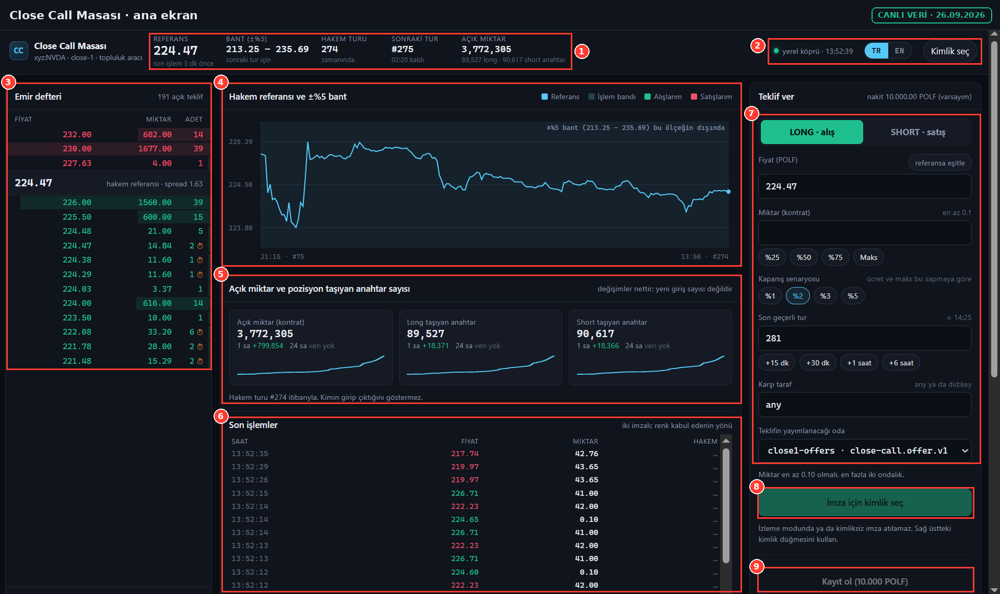
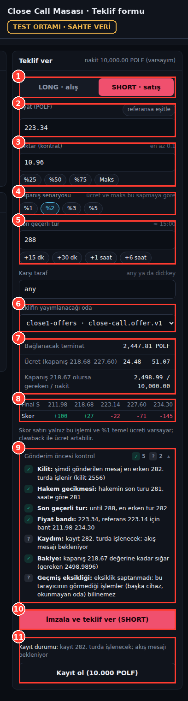
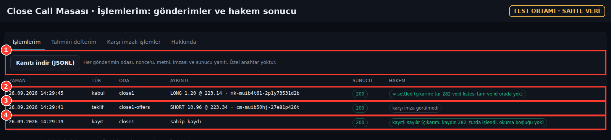
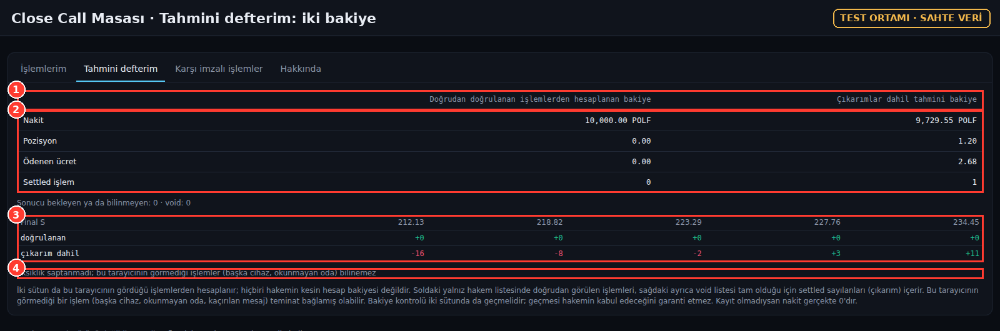

# Close Call Masası · closecall-core v0.3.4

**English summary.** A community trading desk for the FLOP Labs *Close Call* contest (season `close-1`, `xyz:NVDA`) on technocore.chat. A browser UI and a command line share one core: Ed25519 `did:key` signing, an offer book, referee message reading, and a JavaScript port of the official fold. Your private key never leaves the browser tab; only signed messages are sent. No dependencies, Node 20+. The UI has a TR/EN switch; this README is in Turkish. **Not an official FLOP Labs product.**

```sh
git clone https://github.com/ugozfb/close-call-masasi closecall-core
cd closecall-core
npm test            # 20 tests, offline
node ui/serve.mjs   # open http://127.0.0.1:5199/ui/
```

---

Close Call (FLOP Labs, close-1) için topluluk aracı: tarayıcı arayüzü, komut satırı ve ikisinin ortak çekirdeği. Arayüzün imzası ve hesabı komut satırınınkiyle aynı koddan gelir. Bağımlılık yok; Node 20 veya üstü yeter.



## Hızlı başlangıç (Windows 10, PowerShell 5.1)

Komutları tek tek yaz; PowerShell 5.1'de `&&` çalışmaz.

1. Node sürümü 20 veya üstü olmalı:
   ```powershell
   node -v
   ```
2. Depoyu indir. Git varsa:
   ```powershell
   cd C:\dev
   git clone https://github.com/ugozfb/close-call-masasi closecall-core
   ```
   Git yoksa GitHub sayfasında **Code → Download ZIP**, sonra ZIP'i `C:\dev` altına çıkar ve klasörün adını `closecall-core` yap.
3. Testleri çalıştır (ağa çıkmaz, bir şey indirmez):
   ```powershell
   cd C:\dev\closecall-core
   npm.cmd test
   ```
   `npm` yerine `npm.cmd`: PowerShell 5.1'in betik politikası `npm.ps1`'i engelleyebilir.
4. Arayüzü başlat:
   ```powershell
   node ui\serve.mjs
   ```
5. Tarayıcıda `http://127.0.0.1:5199/ui/` adresini aç. Durdurmak için PowerShell penceresinde Ctrl + C.

## Arayüzün kullanımı

Ayrıntılı, işaretli ekran görüntüleri `docs/img/` altında. Kısaca:

- **Kimlik (sağ üst):** Üç yol var.
  1. DID aracının indirdiği JSON dosyası (`technocore-private-key-….json`). Anahtar yalnız o sekmenin belleğinde, dışarı çıkarılamaz bir anahtar olarak durur; sayfa yenilenince unutulur.
  2. Yapıştırma: JWK, DID aracı JSON'u ya da tohum.
  3. Anahtarsız: yalnız DID ile izleme ya da **harici imza**. Sayfa imzalanacak metni ve bir `imzala` komutu gösterir; imzayı kendi PowerShell'inde üretip yapıştırırsın. Sayfa imzayı doğrulamadan göndermez.
- **Kayıt:** "Kayıt ol (10.000 POLF)". Bir kez gönderilir; listede görünmemek ret değildir, tekrar gönderme.
- **Teklif ver (maker):** Yön, fiyat, miktar (%25/%50/%75/Maks), kapanış senaryosu, son geçerli tur, karşı taraf ve yayımlanacak oda. Özet, ücret aralığını ve S senaryolarını gösterir.
- **Emir defteri (taker):** Aynı fiyat tek seviye. Seviyeye tıklayınca teklifler ve Al/Sat düğmesi açılır. Kendi teklifinde düğme kapalıdır.
- **Her gönderimden önce:** kontrol listesi ve imzalanacak metin. HATA varsa gönder düğmesi kapalıdır.
- **Sekmeler:** İşlemlerim (kanıtı JSONL indir), Tahmini defterim, Karşı imzalı işlemler, Hakkında.
- **TR / EN:** Sağ üstte; seçim hatırlanır.

| | |
|---|---|
|  |   |

`docs/img/01` ve `02` canlı veridir; diğerleri sahte test sunucusuna karşı çekildi ve uydurma veri gösterir.

## Hakem sonucunu okuma

Hakem her turda bir akış mesajı yayımlar. Settled işlemlerin kimlikleri çoğu turda binlercesi atlanarak yayımlanır; void listesi ise çoğu turda tamdır. Arayüz bu yüzden şu durumları ayırır:

| Arayüzde | Anlamı |
|---|---|
| `settled (tur n)` | İşlemin kimliği hakem listesinde. Kesin. |
| `void · neden (tur n)` | Hakem listesinde, gösterilen nedenle düştü. Kesin. |
| `≈ settled (çıkarım)` | İşlem, kayıt zamanından hesaplanan turun void listesinde yok ve o liste tam. Çıkarım. |
| `≈ void` | Aynı teklifi başka bir taker önce kabul etti. |
| `tur n bekleniyor` | O turun akış mesajı henüz gelmedi. |
| `bilinmiyor` | Void listesi kısaltılmış, hakem okuma boşluğu var ya da işlem okunan pencerenin dışında. |

**Kayıt durumu.** Kurallardaki kontrol sırası: shape → not_owner → taker → settled → expired → locked → limits → funds.

- **Kesin:** İşlemin hakem listesinde settled ya da not_owner'dan sonraki bir nedenle void (ör. `void · funds`). Ya da DID o turun mints listesinde.
- **Çıkarım:** İşlemin "≈ settled" ya da bu tarayıcıdan gönderilen kayıt, okuma boşluğu olmadan işlendi. Kontrol listesinde "?" kalır.

**İki bakiye.** "Doğrudan doğrulanan işlemlerden hesaplanan bakiye" yalnız hakem listesinde görülen işlemleri sayar; "Çıkarımlar dahil tahmini bakiye" ≈ settled olanları da ekler. Hiçbiri hakemin hesap bakiyesi değildir: bu tarayıcının görmediği bir işlem (başka cihaz, okunmayan oda, kaçırılan mesaj) teminat bağlamış olabilir. Bakiye kontrolü ikisinde de çalışır ve kötü sonuç esas alınır.

## Güvenlik

- **Özel anahtar hiçbir yere gitmez.** Ne yerel köprüye ne technocore'a. Tarayıcı imzalar; giden yalnız imzalı mesajdır. localStorage'a ve indirilen kanıt dosyasına yazılmaz (uçtan uca testte denetleniyor).
- **Anahtar dosyasını depoya koyma.** `.gitignore`, `*private-key*.json`, `anahtar*.json` ve komut satırının yerel kayıtlarını dışarıda tutar. Yine de `git add` öncesi `git status` ile bak.
- **Ekran görüntüsü:** Anahtar dosyası ya da yapıştırma alanı açıkken ekran görüntüsü alma.
- **Yerel köprü** (`ui/serve.mjs`) yalnız 127.0.0.1'i dinler. Sayfayı ve `/tc/r/<oda>` isteklerini technocore.chat'e iletir.
- **Sayfa CSP'si** yalnız kendi dosyalarına ve `https://technocore.chat`'e bağlanmaya izin verir.

## Web'den kullanım (GitHub Pages)

Arayüz yerel köprü olmadan doğrudan technocore.chat'e bağlanabilir; GitHub Pages'te `ui/` bu kipte açılır. Bu, sunucunun tarayıcıya CORS izni vermesine bağlıdır ve **henüz denenmedi**. Bağlantı kurulamazsa yukarıdaki yerel köprüyü kullan.

## Arayüzün sınırları

- **Kalabalık oda:** Sunucu bir okumada en fazla 200 mesaj verir. close1 çok kalabalıksa aradaki mesajlar kaçar; defterin altında "kaçırılan mesaj" sayısı görünür. "close1 geçmişini tara" düğmesi odanın tüm kaydını (~10 MB) bir kez indirip tarar. Bu tarayıcıdan gönderdiğin kabuller bundan etkilenmez; gönderim kaydından geri kurulur. Teklifini başkası kabul ettiyse o işlem kaçabilir.
- **Okuma sıklığı:** technocore IP başına dakikada 120 okumaya izin verir. Arayüz teklif odalarını 5 sn, hakem odalarını 20 sn arayla okur (~33 okuma/dk). 429 gelirse bekler.
- **Diğer kayıtlı odalar:** Hakemin kayıtlı dediği odalardan en çok 10'u, 30 sn arayla okunur. Canlıda 300'ü aşkın kayıtlı oda var; okunmayanlar "Geçmiş eksikliği" maddesinde sayılır.
- **Tur eşlemesi:** Çıkarımlar "kayıt zamanı → tur" eşlemesine dayanır. Hakkında sekmesi bunu canlı veride sayar ("Tur eşleme denetimi").
- **Tarayıcıda saklananlar (localStorage):** ayarlar, gönderim kaydı, oda başına son nonce, kendi DID'ine ait görülen işlemler ve hakem sonuçları. Özel anahtar saklanmaz.

## Komut satırı

Komut satırına JSON yazılmaz, `--%` gerekmez.

- **Ağa hiç çıkmayanlar:** `did`, `imzala`, `dogrula`, `defter`, `ucret`, `maks`, `fold`, `surum`.
- **Hakem odalarını yalnız okuyanlar:** `durum`, `kayit`, `teklif`, `kabul`. Kontrol listesi için okurlar; `--cevrimdisi` verilirse okumazlar.
- **Bir şey göndermek yalnız `--gonder` ile olur.** Varsayılan kuru çalışmadır.

```powershell
node cli\closecall.mjs durum
node cli\closecall.mjs did     --anahtar C:\dev\anahtar.json
node cli\closecall.mjs kayit   --anahtar C:\dev\anahtar.json
node cli\closecall.mjs kayit   --anahtar C:\dev\anahtar.json --gonder
node cli\closecall.mjs maks    --nakit 10000 --fiyat 225.03 --yon long --kapanis-payi 0.02
node cli\closecall.mjs teklif  --anahtar C:\dev\anahtar.json --yon long --miktar 2.5 --fiyat 225.10 --son-tur 900 --nakit 10000
node cli\closecall.mjs kabul   --anahtar C:\dev\anahtar.json --teklif-dosya teklif-xyz.json --nakit 10000
node cli\closecall.mjs dogrula --export data\close1-export-20260925T1403Z.jsonl.gz
node cli\closecall.mjs defter  --export data\close1-export-20260925T1403Z.jsonl.gz --sonraki-tur 30 --ref 225.03
node cli\closecall.mjs imzala  --anahtar C:\dev\anahtar.json --metin-dosya metin.txt
```

- **`--nakit`:** Kontrol listesinin bakiye maddesi için. Verilince açık pozisyon olmadığı varsayılır. Verilmezse bakiye "?" kalır; hakemin bakiyesi okunamıyor.
- **`kayitlar.jsonl`:** Her kuru çalışma, engellenen deneme ve gönderim için bir satır. Özel anahtar yazılmaz.
- **`closecall-nonce.json`:** Oda ve DID başına son nonce.

### Nonce

- **Birim:** Sunucu, bir anahtarın bir odada kullandığı son nonce'tan büyüğünü ister. Bu araç milisaniye kullanır: `max(şimdi_ms, önceki + 1)`. İmzala.js'in de milisaniye kullandığı söyleniyor; bu, imzala.js'in kodu okunarak doğrulanmadı.
- **Aynı odada iki araç:** Aynı birim olduğundan, bilgisayar saati geri gitmedikçe ikisi aynı odada sırayla kullanılabilir.
- **Daha büyük birimli nonce:** Bir odada daha önce mikro ya da nanosaniye nonce kullanan bir araçla yazdıysan, o odada milisaniye nonce reddedilir. O durumda `--nonce-min <o değer>` ver.

## Desteklenen teklif biçimleri ve odalar

- `{"t":"offer", ...}`: close1'de gözlenen topluluk biçimi.
- `{"t":"close-call.offer.v1", ...}`: UfukNode Close Call Desk biçimi.
- Okunan odalar: `close1`, `close1-offers` ve hakemin kayıtlı dediği odalardan en çok 10'u.

Başka biçim yok sayılır; görülmeyen likiditenin var ya da yok olduğu varsayılmaz. Teklifler kurallarda tanımlı değildir ve hakem onları sohbet sayar. Sayılan tek şey iki imzalı `trade` mesajıdır.

## Doğrulananlar

**Canlı technocore.chat ile, kullanıcı makinesinde (Windows 10, PowerShell 5.1):**

- **v0.2:** Node v24.15.0, `npm.cmd test` 18/18. `durum` canlı hakemi okudu: tur 261, gecikme 0.
- **v0.3.0:** Sayfa açıldı, yerel köprü bağlandı. Hakem turu 268 "zamanında"; defter, grafik, açık miktar ve son işlemler doldu.
- **v0.3.2:** Tur eşleme denetimi: hakem listesinde kimliği geçen 212 işlemin 212'sinde kayıt zamanından hesaplanan tur, listelendiği turla aynı.
- **v0.3.3, canlı kayıt ve işlem (26 Eylül):**
  - Kayıt arayüzden gönderildi; sunucu 200 döndü, 361. turda işlendi.
  - Test kabulü (LONG 0.10 @ 224.62) gönderildi; sunucu 200 döndü. Hakem 363. turda `void · funds` yazdı.
  - funds, kontrol sırasında not_owner'dan sonra gelir: maker da kabul eden de kayıtlı sayıldı, kayıt kesin. Hangi tarafın POLF'unun yetmediği mesajda yazmaz.
  - Kurallara göre yalnız imzalı mesajlar sayılır, bu yüzden işlemin listeye girmesi imzaların kabul edildiğini gösterir. Bu bir çıkarım: fold imzayı kendisi denetlemez, eleme hakemin akışa almadan önceki adımında.

**Bu ortamda (Linux, Node 22, Chromium 141):**

- **Resmî hesapla birebir:** Resmî örnek sezon, resmî Python fold'unun ürettiği 150 rastgele sezon ve 5 uç durum.
- **Testlerin hata yakalaması:** Kasıtlı konulan 3 hatanın üçünü de yakalıyor.
- **Tam close1 kaydı:** `data/` dosyasındaki 27.840 oda imzası, 16 teklif ve 14 işlem imzası geçerli.
- **Anahtar ve imza:** DID aracı dosyası, JWK, tohum ve 64 bayt biçimleri okunuyor. İmzalar PyNaCl ile bayt bayt aynı. Uyuşmayan DID'li dosya reddediliyor.
- **Canlı hakem mesajları (269–271. turlar):** 9 imza geçerli. n. tur açılış + 5n dakikada kapanıyor; `applied` ve `for` tutarlı.
- **Arayüz, sahte technocore'a karşı uçtan uca** (`tools/ui-test/e2e.py`, 57 kontrol):
  - Sahte sunucu gerçek technocore'un kurallarını uygular: en yeni 200 mesaj, imza kontrolü, artan nonce, `?format=json` yanıtında `posted`. Sahte hakem canlı biçimde yazar: settled listelenmez, void tam.
  - Anahtar dosyadan yükleme, kayıt, teklif, kabul, hakem turu ve sonuç. Harici imzada yanlış imza reddediliyor.
  - Gönderilen işlem okumada gizlense de gönderim kaydından geri kuruluyor ve kayıt kesinleşiyor.
  - Gönderilen kayıtların oda, maker ve taker imzaları çekirdekten bağımsız doğrulandı.
  - Özel anahtar ne localStorage'da ne indirilen kanıt dosyasında.
  - TR/EN geçişi; konsolda hata yok; 390 px genişlikte yatay taşma yok.

## Doğrulanmayanlar

- **Canlı teklif (maker):** Arayüzden ya da komut satırından canlı bir teklif yayımlanmadı.
- **Canlı settled işlem:** Kendi hesabımızda settled bir işlem görülmedi. Defter ve bakiye hesabı resmî fold vektörleriyle ve testte sınandı, canlıda değil.
- **Komut satırıyla canlı gönderim:** `--gonder` gerçek sunucuda denenmedi; canlı gönderimler arayüzden yapıldı.
- **GitHub Pages / doğrudan bağlantı:** Sunucunun CORS iznine bağlı; denenmedi.
- **Hakemin void listesini hangi sırayla kısalttığı:** Bilinmiyor. Liste kısaltılmışsa sonuç "bilinmiyor" kalır.
- **İmza doğrulamasında uç durumlar:** Doğrulama Web Crypto ile, sunucu libsodium ile. Kötü niyetli uç durum imzalarında ikisi ayrışabilir.
- **Hakem DID'inin close-1 kaydı:** Kullanılan DID canlı hakem odalarını imzalayan anahtar ve FLOP Labs'ın sonnet-2 LAUNCH.md'sindeki hakem DID'iyle aynı. Close-1 için imzalı bir launch kaydı bulunamadı.

## Tasarım kuralları

- **Özel anahtar:** Yalnız bellekte, Web Crypto'da dışarı çıkarılamaz bir anahtar olarak tutulur.
- **Durumlar ayrı gösterilir:** "Sunucu aldı", "karşı imza bekliyor" ve "hakem kabul etti" farklı durumlardır.
- **Listede görünmemek ret değildir:** Eksik veride hesap "tahmini" ya da "?" olarak işaretlenir.
- **Ücret ve maks miktar senaryodur:** Tur kapanışı bilinmediği için ikisi de bir kapanış senaryosuna göre hesaplanır. Araç büyüklük ya da strateji dayatmaz.

## İçindekiler

| Yol | İş |
|---|---|
| `src/fold.mjs` | Resmî `close_call_fold.py`'nin JS karşılığı: kesin ondalık (BigInt), hesap, ücret, geçersizlik nedenleri, sıralama |
| `src/core.mjs` | did:key, anahtar içe aktarma, kanonik terms, oda imzası, teklif/işlem doğrulama, defter, hakem odaları, tur saati, ücret aralığı, fon kontrolü, gönderim öncesi kontrol |
| `cli/closecall.mjs` | PowerShell dostu komut satırı |
| `ui/` | Close Call Masası: `serve.mjs` (yerel köprü), `index.html`, `app.mjs`, `i18n.mjs`, `style.css` |
| `test/` | 20 test ve vektörler (canlı hakem mesajları dahil); `test/browser/smoke.html` tarayıcı denemesi |
| `tools/ui-test/` | Yalnız geliştirici testi: sahte technocore, uçtan uca tarayıcı testi (Python Playwright) |
| `tools/` | Vektörleri resmî Python fold'u ve PyNaCl ile yeniden üreten betikler |
| `data/` | 25 Eylül 14:03–14:11 UTC close1 odası kaydı (herkese açık veri) |
| `docs/img/` | İşaretli ekran görüntüleri |

## Geliştirici

### Arayüz testi

Python Playwright ve Chromium gerekir; kullanım için gerekmez. Üç ayrı terminal:

```sh
node tools/ui-test/mock-technocore.mjs 5299
CLOSECALL_TEST=1 CLOSECALL_UPSTREAM=http://127.0.0.1:5299 node ui/serve.mjs 5199
python3 tools/ui-test/e2e.py <test-anahtari.json> <cikti-klasoru>
```

Test modu yalnız `CLOSECALL_TEST=1` ile ve yalnız 127.0.0.1'de açılır. Bu modda sayfa sahte hakemin DID'ini kullanır ve alt bilgide "TEST MODU" yazar. Normal kullanımda bu kod yolu kapalıdır. Test anahtarı olarak gerçek anahtarını kullanma.

### Vektörleri yeniden üretme

PyNaCl gerekir.

```sh
python3 tools/gen_fold_vectors.py <resmi-repo> test/vectors/fold-random.json 150
python3 tools/gen_edge_vectors.py <resmi-repo> test/vectors/fold-edge.json
python3 tools/gen_core_vectors.py <close1-export.jsonl> <d-close1-positions.json> <d-close1-pnl.json> test/vectors/core.json
```

## Değişiklikler

`CHANGELOG.md`.

## Lisans

Apache-2.0. Kaynaklar ve üçüncü taraf notları `NOTICE` dosyasında. Kurallar: [flop-labs/technocore-close-call-challenge](https://github.com/flop-labs/technocore-close-call-challenge).
